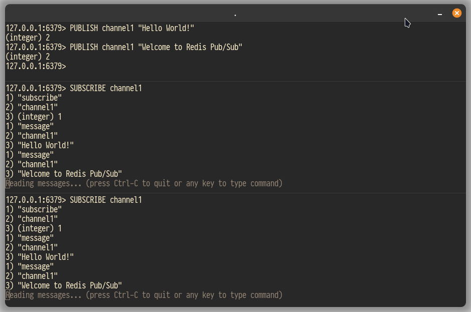

## Redis Pub/Sub Example 1

Steps:

1. Start Redis Stack (Redis Server + Redis Insight). \
   Using `docker run -d --name redis-stack -p 6379:6379 -p 8001:8001 redis/redis-stack:latest` \
   Note that the exposed ports are: \

    - 6379 = where Redis Server listens for requests. \
    - 8001 = where Redis Insight can be reached.

2. Go to Redis Insight (using http://localhost:8001) \
    - Connect to the (default "My Redis Stack Database") database
    - In the Browser section, add a key of type HASH
3. Start three CLI clients.
   Using `docker exec -it redis-stack redis-cli` in three different terminals.
4. Two of the CLI clients are subscribers. \
    - On each of the two run `SUBSCRIBE channel1`
5. The third one is a publisher. \
    - Publish some messages using `PUBLISH channel1 "{some-message-text}"

See an example of the outcome:

