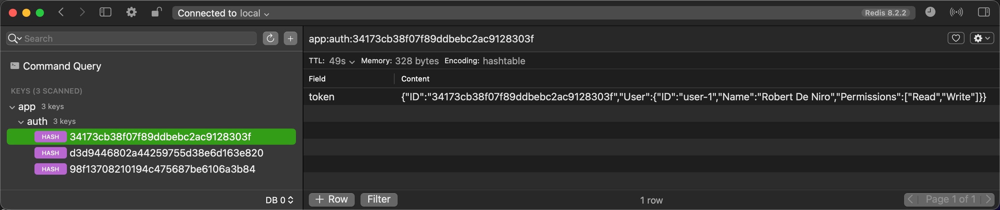

## Test Redis Hash w/ Go

This is a demo of using Redis Hashes to store Go structs.

 

### Usage

Besides starting the Redis server using `docker-compose up -d`, you can run the tests that populate it with data using `go test internal/storage/auth.go internal/storage/auth_test.go`.

The result is the following:

